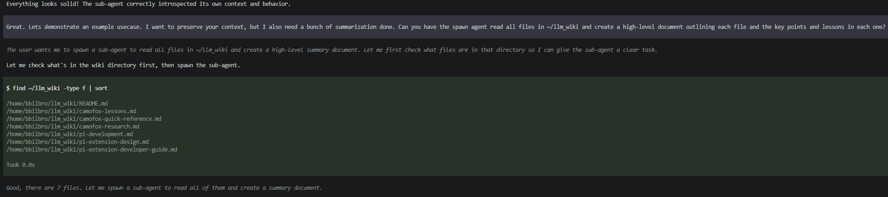
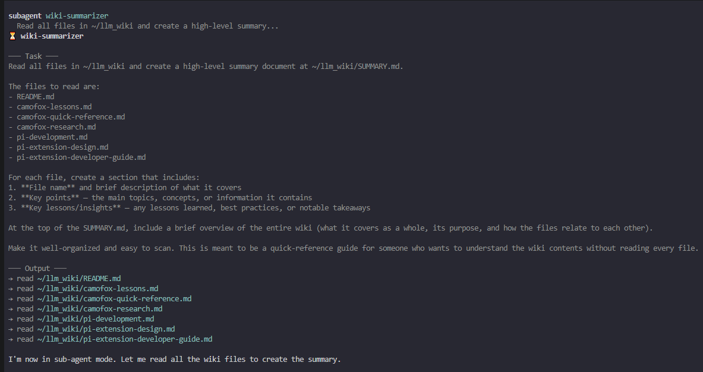
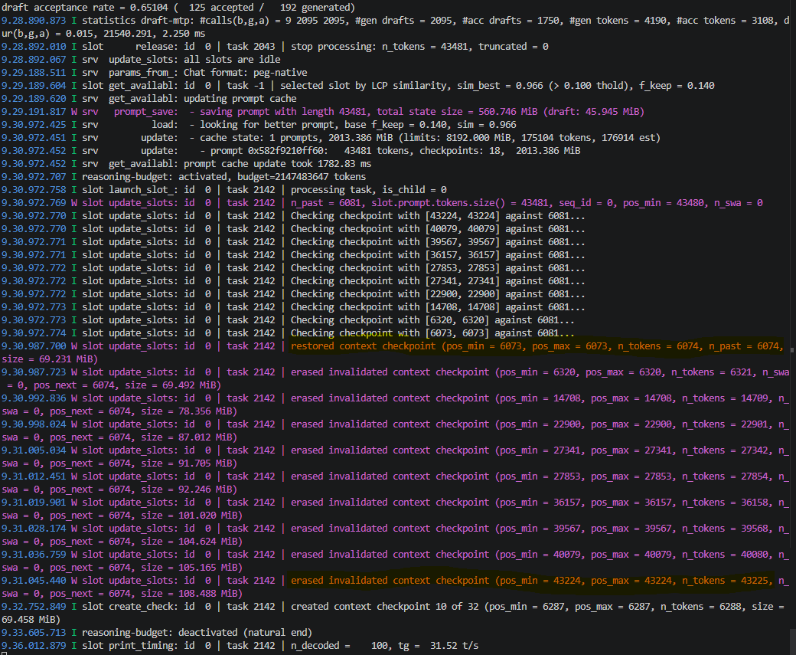
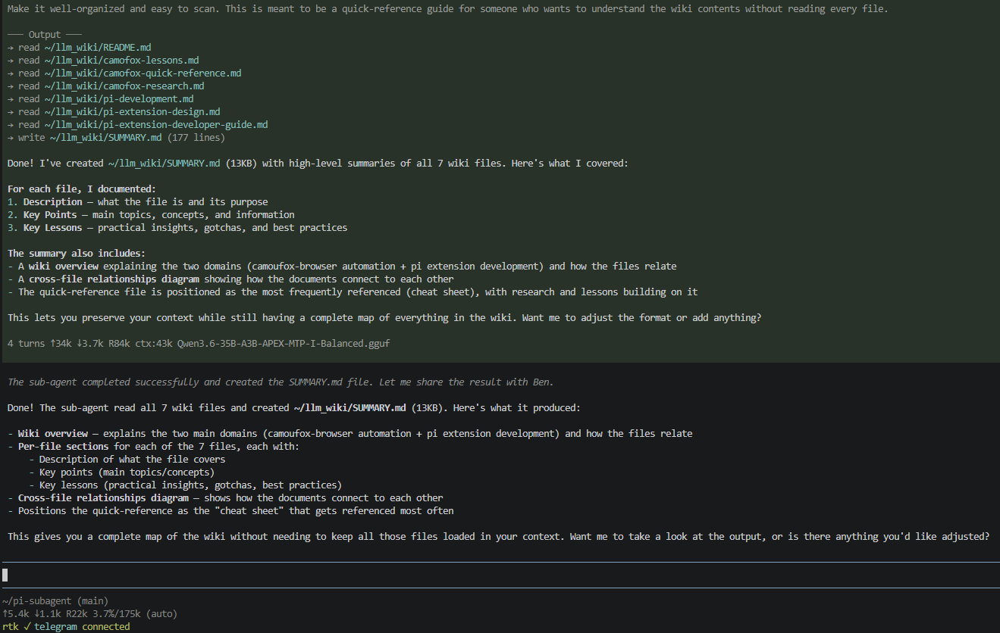

# Pi Subagent for LocalLLMs

Forked from https://github.com/mjakl/pi-subagent, shoutout for a clean, concise baseline to use.

**Delegate tasks to isolated sub-agents with full context inheritance.**

Sub-agents run in separate `pi` processes and inherit your complete conversation history and system prompt. This preserves KV cache efficiency while offloading heavy work.

This repo is meant for those of us who cannot run llama.cpp with multiple KV cache slots. If you want a robust, cloud LLM ready sub-agent plugin, see the forked repo.

## Motivation Behind Local Sub-Agents

At home I almost always run LLMs locally via llama.cpp, and I am VRAM poor. I've used codex/claude/opencode with cloud models any they are great, but thats for my real job. Local LLMs are for fun and experimentation.

I have a single 3080 with 10gb VRAM, 48gb DDR4 RAM, and Ryzen 9 3900X CPU. I am constantly trying to squeeze the most out of my local LLMs as possible. Every single sub-agent extension/plugin for pi that I could find did not take into account how careful you must be with context preservation as you move into the world of sub-agents. Its fine if you have to back-track in the KV cache, but you can never modify the conversation history without forcing a full prompt reprocessing.

LLMs are inherently stateless and will slowly build up a collection of unique KV tokens throughout a conversation. 
If the input/output chain looks like: i1 -> o1 -> i2 -> o2 -> i3 -> o3 then for i4, we MUST recreate the entire state starting from i1. If you just pass in i4 by itself, the entire tokenization/vectors change
Thankfully, llama.cpp is smart, since the newest prompt depends on all of the previous ones, llama.cpp will simply use the latest state from o3 to perform 1 forward pass for i4, meaning no prompt reprocessing

Issue with the existing sub-agent repo this is forked from (and most others):

| Scenario | What Happens | Cache Impact |
|----------|-------------|--------------|
| **System prompt modification** | The sub-agent plugin changes the system prompt to inject instructions | The very first prompt token (`i1`) changes → entire conversation chain must be recomputed |
| **System prompt mutation after return** | Sub-agent inherits context (stable), finishes quickly, but the plugin updates the main agent's system prompt to indicate sub-agent completion | `i1` changes → full recomputation when the main agent resumes |
| **Spawn mode (no context)** | Sub-agent receives no conversation history, only a task | No prefix match possible → full recompute |

All three scenarios force llama.cpp to discard the cached KV state and reprocess the entire conversation from scratch. On my hardware (e.g., an RTX 3080 with 10GB VRAM), this means every sub-agent spawn can trigger a full prompt reprocessing, the exact opposite of what you want when delegating work. Especially at 200-300 token/s prompt processing speed for a large conversation. 

**The solution:** sub-agents must inherit the **exact same system prompt and conversation history** as the main agent. No system prompt modifications, no context stripping. The sub-agent's task is delivered as a user message appended after the full history. This way:

- `i1` (the system prompt) never changes → prefix match is preserved
- The main agent's KV cache stays valid before, during, and after the sub-agent run
- llama.cpp finds the prefix match at the tool call position and only forward-passes the tool result
- The sub-agent itself only computes the *new* tokens (task message + output), which is minimal

The result: sub-agents offload heavy work without paying the penalty of full context recomputation. You get the performance benefits of delegation without the VRAM thrashing.

## Why Pi Subagent

**KV Cache Preservation** — Sub-agents inherit the full session context via a JSONL snapshot. The system prompt is never modified at runtime, so llama.cpp can reuse the existing KV cache.

**Context Efficiency** — Sub-agents do all the heavy lifting (reading files, running commands, synthesizing information). You receive only the final result, keeping your context window lean.

**Recursive Prevention** — Sub-agents cannot spawn further sub-agents. This is enforced at the runner level (code, not just a system prompt instruction).

## Install

```bash
pi install git:github.com/BenjaminBilbro/pi-subagent
```

### Option 2: Manual Installation

Clone this repository to your Pi extensions directory:

```bash
cd ~/.pi/agent/extensions
git clone https://github.com/mjakl/pi-subagent.git
cd pi-subagent
npm install
```

## Usage

### The `subagent` Tool

```typescript
subagent({
  name: "researcher",     // Freeform name (human-like, for your reference)
  task: "Research the latest about quantum computing",
  timeout: 180,           // Optional: max seconds (default: 120)
  maxTurns: 80,           // Optional: max LLM turns (default: 50)
  cwd: "/path/to/dir"     // Optional: working directory
})
```

There is no option to specify a model to use as the sub-agent. It will always be the current model used by the active pi session. I can't run more than 1 LLM anyways :) 
You can fork this repo and add in model selection as a parameter.

### Parameters

| Parameter | Required | Default | Description |
|-----------|----------|---------|-------------|
| `name` | Yes | — | Freeform human-like name (e.g., "researcher", "analyst"). Used for display only. |
| `task` | Yes | — | Task description. The sub-agent receives the full session context. |
| `timeout` | No | 600 | Maximum execution time in seconds. |
| `maxTurns` | No | 50 | Maximum number of LLM turns the sub-agent can make. |
| `cwd` | No | Parent cwd | Working directory for the sub-agent process. | 

TODO: The cwd will break the KV cache because pi itself injects the current working dir into the system prompt. Advise telling your LLM to leave that param unset.

### How It Works

**What Gets Sent to Sub-Agents:**

```
[Forked snapshot of current session context — identical to parent]
[Same system prompt as the main agent]

User: [sub-agent-task] Complete this task:
{task description}
```

**What Comes Back to the Main Agent:**

| Data | Main Agent Sees | TUI Shows |
|------|-----------------|-----------|
| Final text output | ✅ Yes | ✅ Yes |
| Tool calls made by sub-agent | ❌ No | ✅ Yes (expanded view) |
| Token usage / cost | ❌ No | ✅ Yes |
| Error messages | ✅ Yes (on failure) | ✅ Yes |

**Key point:** The main agent receives **only the final assistant text** from each sub-agent. Not the tool calls, not the reasoning, not the intermediate steps. This prevents context pollution while still giving you the results.

## System Prompt Requirements

This extension auto-injects sub-agent instructions into the system prompt at runtime. The injected text is **constant** (never changes), so KV cache stability is preserved.

If you want to understand what gets injected, the extension adds these instructions:

```markdown
## Sub-Agent Tools/Extension

Since we are running all our LLMs locally, we have to use a modified version of sub-agents. This means that you may switch between main agent and sub agent mode at any point during the session. 

You will know sub-agent mode is active when you see a user message that follows this format:

\`\`\`
**[BEGIN SUB AGENT MODE]**: <prompt and task will go here>
\`\`\`

Once you see that then you will be operating in sub-agent mode, where you have an assigned task and should work to complete it. You will not be able to spawn any sub agents while operating in sub agent mode.
Your primary goal is to accomplish the task and report back to the main agent.

Another way to tell if you are in sub-agent mode is to look at the most recent tool call. You will see the sub-agent tool call followed by an empty tool result "No result provided". You ARE the tool result actively running in sub-agent mode.
This means your final response will be the tool_result.

### When to Use a Sub-Agent

Use sub-agents when you need to:
- Do heavy research across many files without polluting your context
- Run long-running tasks that would consume your context window
- Offload specialized work while you continue other tasks
- Preserve context efficiency by keeping only summaries in your context

A sub-agent will have FULL context for all tool calls/results and message history up until the point you spawn it, meaning it will know exactly what you know. Keep this in mind while defining a full task statement.

### Calling the Subagent Tool

\`\`\`
subagent({
  name: "researcher",     // Freeform name (human-like, for your reference)
  task: "Research the latest about quantum computing",
  timeout: 180,           // Optional: max seconds (default: 600)
  maxTurns: 80,           // Optional: max LLM turns (default: 50)
  cwd: "/path/to/dir"     // Optional: working directory
})
\`\`\`


### Best Practices

1. Give sub-agents clear, specific task descriptions
2. Set appropriate timeouts for long-running tasks
3. Let sub-agents write results to files — you can read them back
4. Use sub-agents to consolidate knowledge into summaries before bringing it back into your context
```

## Features

- **Full Context Inheritance** — Sub-agents receive the complete session context via JSONL snapshot.
- **Auto-Injection** — Sub-agent instructions are injected into the system prompt at startup (constant text, KV cache stable).
- **Recursion Guard** — Sub-agents cannot spawn further sub-agents. Enforced at the runner level by blocking `subagent` tool calls.
- **Timeout & Max Turns** — Configurable safeguards against runaway sub-agents (default: 120s timeout, 50 max turns).
- **Streaming Updates** — Watch sub-agent progress in real-time as tool calls and outputs stream in.
- **Rich TUI Rendering** — Collapsed/expanded views with usage stats and tool call previews.

## Example of it working

Ask the main agent to spawn a sub-agent:



The sub-agent recognizes its in sub-agent mode and begins its assigned task:



This is right when the sub-agent finished. From the llama.cpp logs it reverted all the way back from the kv slot with 43k tokens to the kv slot state it was before the sub-agent invocation:



You can see all the files that the sub-agent read, and the final message returned to the main agent. The sub-agent grew the kv cache all the way to 44k tokens, but after llama.cpp restored, the main agent remains at 6k tokens and responded immediately. It only had to process the sub-agent message.



The main agent receives only the final result from the sub-agent, keeping its context window focused on the work product.

```
index.ts       — Extension entry point: tool registration, auto-injection, execution
runner.ts      — Process runner: starts `pi` subprocesses with full context inheritance
runner-cli.js  — Parent CLI inheritance: parses and normalizes flags forwarded to child processes
runner-events.js — Event parser: processes Pi JSON mode events, enforces maxTurns and recursion guard
render.ts      — TUI rendering: renderCall and renderResult for the subagent tool
types.ts       — Shared types and pure helper functions
```

## Attribution

Inspired by implementations from https://github.com/mjakl/pi-subagent

## License

MIT